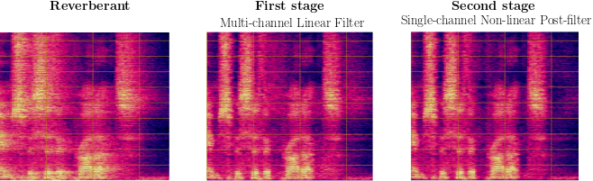

### Two-stage Dereverberation Algorithm

<p align="center">

</p>

# 1. Installation

Install requirements with `pip instlal -r requirements.txt`
GPU-acceleration is supported for both the DNNs and the DSP operations

# 2. Usage

This code is for inference only, training loops are unfortunately not being made available
To download the models, please use [this link](https://drive.google.com/drive/folders/11r2LWqeE_EUW25MfVIp3vzzwRURQYsBy?usp=drive_link) and put the obtained `.pt` files in `./models`

To perform inference, simply use
```python3 derev.py --speech <speech_file_path> --config <config_key>```

with one of the following `config_key`:
- `wpe_ci`: End-to-end optimized multi-channel linear filter targeted for cochlear implant users (few early reflections)
- `wpe_ha`: End-to-end optimized multi-channel linear filter targeted for hearing-aid users (more early reflections)
- `wpe+pf_ci`: End-to-end optimized multi-channel linear filter + non-linear single-channel post-filter targeted for cochlear implant users (few early reflections)
- `wpe+pf_ha` (default, recommended): End-to-end optimized multi-channel linear filter + non-linear single-channel post-filter targeted for hearing-aid users (more early reflections)

# References

Please consider citing our work if you found this useful:

```
@article{lemercier2022a,
    author={Lemercier, Jean-Marie and Thiemann, Joachim and Koning, Raphael and Gerkmann, Timo},
    title={A neural network‐supported two‐stage algorithm for lightweight dereverberation on hearing devices},
    year={2023},
    journal={EURASIP Journal on Audio, Speech, and Music Processing},
    volume={18},
    pages={1-12},
    doi={https://doi.org/10.1186/s13636-023-00285-8},
}
```